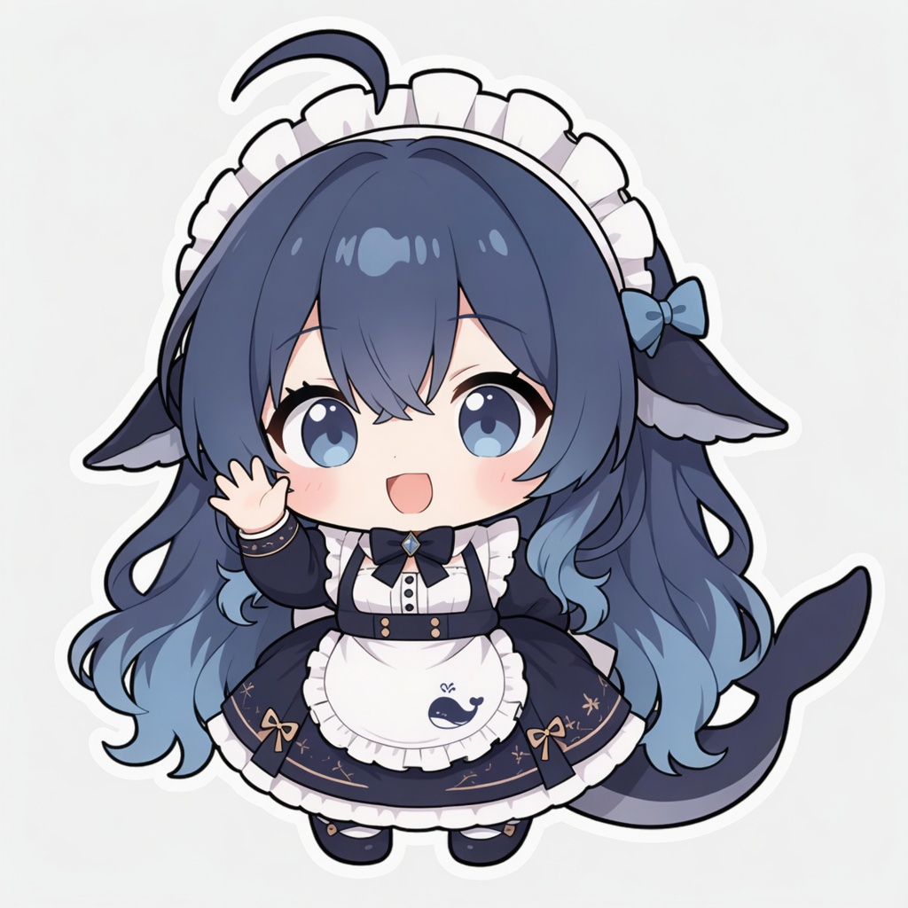

  

 

  

  <h1>嗨，我是 Yan Du / theone39</h1>
  
机器狗群控 · 发中英论文 · 偶尔写点开源 skill

  
主页看板娘是社区二创的 <strong>DeepSeek 鲸鱼娘</strong>。🍚 先吃饭，再深度求索。

### 在做什么

- 四足机器人 / 多机协同（ROS2）
- 科研写作（中文、英文都发）
- 把难懂的概念讲成人话：[explain-simply](https://github.com/theone39/explain-simply)

### 栈

  

  
  鲸鱼娘形象源自社区二创：角色原作 <a href="https://www.pixiv.net/users/62155430">上善无形</a>（溟月），
  DeepSeek 女仆二创 <a href="https://www.pixiv.net/users/18604994">ZipZipPipe</a>。
  参考图来自 <a href="https://github.com/fornarwhal/deepseek-whale-girl-icon">deepseek-whale-girl-icon</a>（CC BY-NC-SA 4.0）。
  本页立绘/横幅为基于该形象的新绘制，仅用于个人主页。
  

