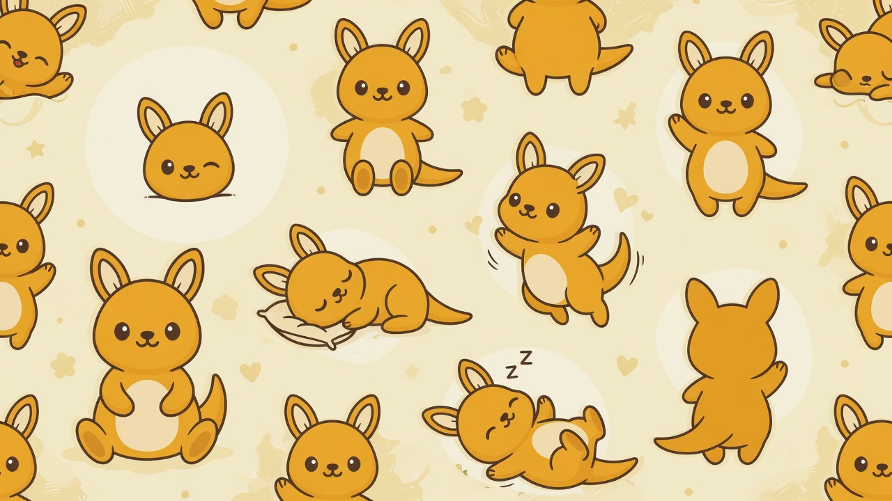
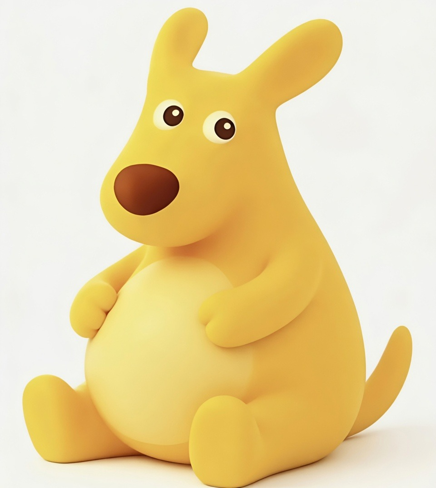

  

 

  

  <h1>嗨，我是 Yan Du / theone39</h1>
  
机器狗群控 · 发中英论文 · 偶尔写点开源 skill

  
主页看板是美团那只黄袋鼠。胆子可以肥嘟嘟，论文不行。

### 在做什么

- 四足机器人 / 多机协同（ROS2）
- 科研写作（中文、英文都发）
- 把难懂的概念讲成人话：[explain-simply](https://github.com/theone39/explain-simply)

### 栈

  

  
  黄袋鼠是美团外卖吉祥物的个人主页二创，非正式周边，和美团公司无关。
  

